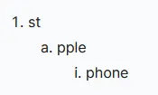

+++
title = "AsciiDoc—Markdown以外的選擇"
date = 2024-04-12T01:20:38+08:00
tags = ["asciidoc", "markdown"]
categories = []
draft = false
summary = "Battery-included Markup Language"
+++

Markdown這種可讀性高又能轉譯成HTML的格式近年來相當受到歡迎，從GitHub README[^1]的`.md`格式佔比就可知道他的火紅程度，甚至打破程設領域擴散到筆記的世界，如[HackMD](https://hackmd.io/)、[Obsidian](https://obsidian.md/)甚至[Notion](https://www.notion.so/)全都看得見Markdown的影子，許許多多書本、文檔都是由Markdown在背後支撐，但是有天我在寫Markdown時想到「可以把圖片置中嗎？」

...

很遺憾，單純的Markdown語法無法作到這一點，有個替代方案是寫HTML呈現對吧？但我認為在Markdown寫HTML本身就違背了簡化表示的美意，而且會顯得十分冗長不易讀。

那麼問題就來了，有什麼格式既能夠保持可讀又靈活多變呢？

[AsciiDoc](https://asciidoc.org/)在此聽候差遣！！AsciiDoc是為技術寫作（technical writing）而生的純文字標記語言，具備許多開箱即可用的標記元素，還能進一步轉換成HTML、PDF等格式。


## 語法

單單用文字敘述AsciiDoc豈不索然無味？我們來實際看看AsciiDoc和Markdown語法對照吧：

### 🔗連結

```md
[Markdown]
[GitHub](https://github.com)
```

```adoc
[AsciiDoc]
https://github.com[GitHub]
```

看起來頗相似對吧？但AsciiDoc還有提供類似變數的功能，讓作者能給連結別名並集中管理，例如：

```adoc
// 定義
:githublink: https://github.com
// 使用
{githublink}[GitHub]
```

### 🖼️圖片

```md
[Markdown]

```

```adoc
[AsciiDoc]
image::https://i.imgur.com/FK0WU3J.gif[美緒淋雨]
```


AsciiDoc能耐不只單純顯示圖片而已，往右往左對齊都不是問題！

```adoc
[AsciiDoc]
// 靠右
image::https://i.imgur.com/FK0WU3J.gif[美緒淋雨,role=right]
// 靠左
image::https://i.imgur.com/FK0WU3J.gif[美緒淋雨,role=left]
```


### 📜清單

#### 無序清單

```md
[Markdown]
* apples
* orange
  * temple
  * navel
* bananas
```

```adoc
[AsciiDoc]
* apples
* oranges
** temple
** navel
* bananas
```

從行首就能知道是第幾階，因此我比較喜歡AsciiDoc的版本。

#### 有序清單

```md
[Markdown]
1. first
2. second
3. third
```

```adoc
[AsciiDoc]
. first
. second
. third
```

用點(`.`)就能自動遞增數字，不用自己計算。雖說Markdown全部用同樣的數字也會自動遞增，但總覺得有點違和感。AsciiDoc除了一般的數字以外，還提供了**多層次清單**，預設階層為`1`→`a`→`i`（阿拉伯數字→字母→羅馬數字），甚至還可以調整起始數值。

```adoc
[AsciiDoc]
. st
.. pple
... phone
```


## 特色功能

除了上述的基本語法以外，還提供很多千奇百怪語法：

* [自動化目錄](https://docs.asciidoctor.org/asciidoc/latest/toc/)
* [警告區塊（Admonitions）](https://docs.asciidoctor.org/asciidoc/latest/blocks/admonitions/)
* [原始碼高亮](https://docs.asciidoctor.org/asciidoctor/latest/syntax-highlighting/)
* 插入內容（自HTML/AsciiDoc檔、網路）

## 缺點

AsciiDoc看似很神奇什麼事情都做的到，但缺點就是知名度不高，很少人聽過、學過，工具/外掛數量亦輸Markdown一大截（當然AsciiDoc本身就支援很多功能了，外掛的需求沒有Markdown那麼多），例如官方實作只有用Ruby寫的asciidoctor，其他語言的實作相當稀少。

諷刺的是這篇文章是Markdown書寫的，Hugo並不原生支援AsciiDoc，依舊仰賴asciidoctor。

## 相關連結

* [官網快速語法參考](https://docs.asciidoctor.org/asciidoc/latest/syntax-quick-reference/)
* [日文版快速語法參考](https://takumon.github.io/asciidoc-syntax-quick-reference-japanese-translation/)


[^1]: 其實GitHub README也可以用AsciiDoc書寫、預覽，不妨試試README.adoc
