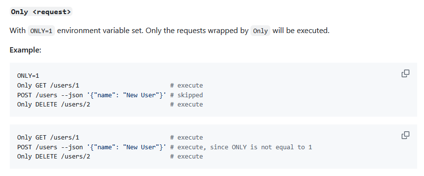
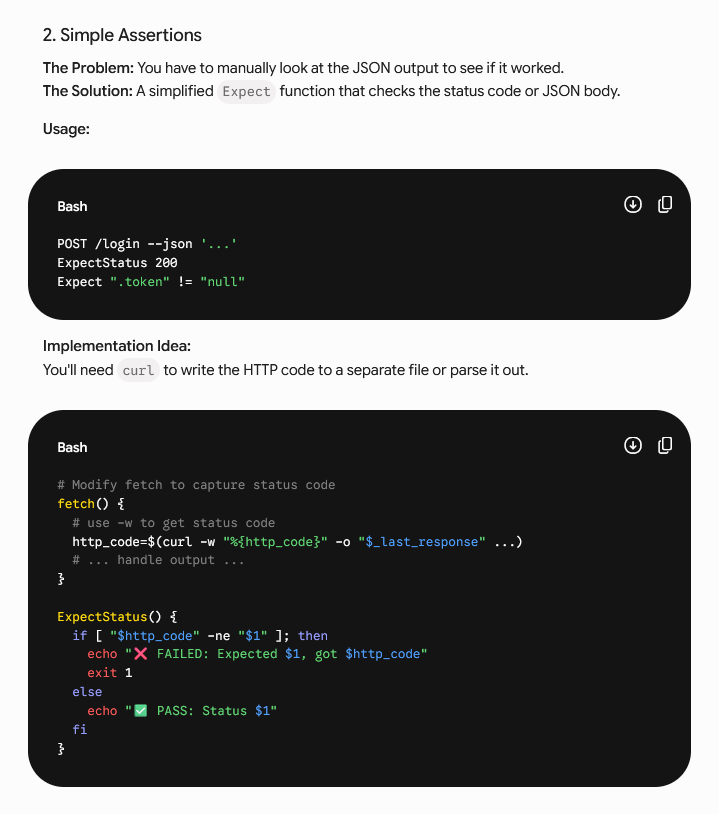
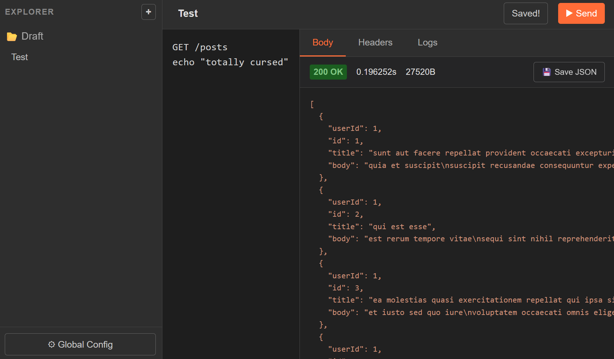

+++
title = 'Poorman：窮人版Postman'
date = '2026-06-22'
draft = false
tags = ['postman', 'shell']
summary = 'shell+curl的極簡主義Postman縫合怪'
+++

對[Postman](https://www.postman.com/)的臃腫忍無可忍的我，用POSIX shell + curl + jq組合出了更可怕的玩意兒：[Poorman](https://github.com/FOBshippingpoint/poorman)

一個簡單的範例：

```bash
#!/bin/sh

. ./poorman.sh

GET /users/1
Snapshot

POST /posts --json '
{
  "title": "poorman",
  "body": "A very limited alternative to postman",
  "userId": 1
}
'
Snapshot
```

`GET/POST`其實只是`curl -X GET/POST`的包裝，要在後面加什麼參數都可以；
`Snapshot`則是指「把API回應貼在這邊」，整個腳本不仔細瞧或許還以為是什麼<abbr title="Domain-Specific Language">DSL</abbr>呢。

## 類DSL

實際上Poorman的語法設計即是效法[ShellSpec](https://github.com/shellspec/shellspec)，
簡單易讀又不失自由度的DSL，只是乍看之下不像，但還是合法的shell腳本。

幾個設計原則：

- 請求方法全大寫：`GET`、`POST`、`PATCH`、`PUT`、`DELETE`

  看起來美觀又熟悉
- 設定值全大寫：`BASE_URL`、`DRY_RUN`

  傳達類似環境變數的感覺
- 公開方法以駝峰命名：`CurlOptionOnce`、`Only`、`BeforeHook`

  與尋常shell function做區隔，一眼就知道是Poorman的function
- 私有方法以底線命名：`_after_hook`、`_self_replace`

  不希望使用者調用、覆蓋的內容

## 充滿範例的文件

我喜歡範例很多的文件。每每看到`man blah`的輸出，
我就會想：老哥能不能給我個範例啊，規格寫的老長卻偏偏不告訴你怎麼用，
因此[Poorman的文件](https://github.com/FOBshippingpoint/poorman/blob/main/README.adoc)中幾乎所有function都有包含範例。



## Out of Scope

為了復現公司JMeter腳本，我曾經想過要不要加入斷言（Assertion），
請AI丟了幾個點子，像是`ExpectStatus 200`、`Expect ".token" != "null"`；
聽起來實在太酷了，被AI灌迷湯的我開始實作這些function，
途中才發覺事情不對勁，edge case和斷言類型沒完沒了，
在shell裡面比較小數就已經夠困難了，
怎還會妄想要用shell（了不起`jq`）實作斷言呢？

> 「每一行程式碼都是債務，最好的程式碼就是不寫程式碼[^1]」

沒人需要的功能只是徒然增加複雜度跟維護困難而已，
於是果斷放棄，將目前的實作含評論維持在297行。




## ...

曾經抗拒的我又回頭發現UI的存在價值，
於是掰哺扣頂一個Python+HTML Web UI：



太可怕了，完全違反初衷，還是洗洗睡吧。

[^1]: https://blog.codinghorror.com/the-best-code-is-no-code-at-all/
