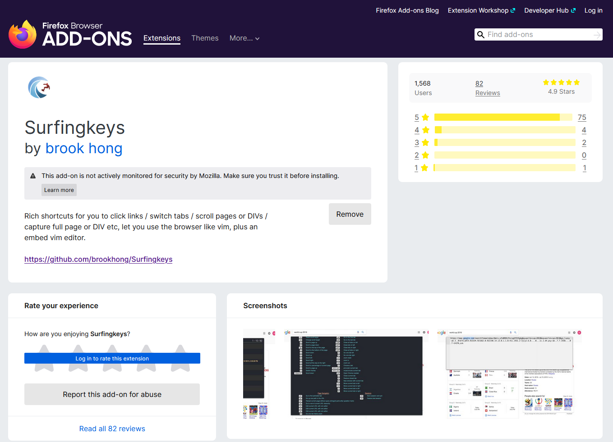

你有沒有想過，在瀏覽的時候不需要使用滑鼠，只需要鍵盤，手指往復間就可以暢遊網路世界。
身為一個快捷鍵中毒者當然有這個夢想。

<!--more-->

起初是先找到一個叫作[Vimb](https://fanglingsu.github.io/vimb/)
的瀏覽器，主打像在Vim
一樣的環境底下瀏覽網頁，不需要滑鼠，但瀏覽器的安全性還是挺重要的，所以就放棄了（況且我瀏覽器已經夠多了）。
接著終於讓我發現Surfingkeys這塊瑰寶，如果你很熟悉Vim的話肯定能迅速上手。

## 下載

首先到[Surfingkeys GitHub 頁面](https://github.com/brookhong/Surfingkeys)下載適合你的瀏覽器的版本，像我
🦊
使用者就是去[Firefox ADD-ONS](https://addons.mozilla.org/en-US/firefox/addon/surfingkeys_ff/)下載。

> 評分 4.9 還挺高的

## 使用

首先按`?`會顯示幫助頁面，建議好好端詳一下內容，以下列出我自己常用的功能：

| 按鍵    | 功能描述                                       |
| ------- | ---------------------------------------------- |
| f       | 導向連結（照黃色字母框順序按下就可以跳至連結） |
| C       | 在新分頁開啟連結                               |
| i       | 跳至輸入（html input）                         |
| x       | 關閉目前分頁                                   |
| yy      | 複製目前分頁網址                               |
| yt      | 複製目前分頁（連瀏覽紀錄也會複製，很方便）     |
| yl      | 複製目前分頁標題                               |
| j       | 向下滾動頁面                                   |
| k       | 向上滾動頁面                                   |
| d       | 向下滾動半頁                                   |
| e       | 向上滾動半頁                                   |
| G       | 滾動至頁尾                                     |
| gg      | 滾動至頁首                                     |
| Alt + s | 在此網站開啟/關閉 Surfingkeys                  |

請看我的實機演示：

大概就這樣，是不是迫不及待要來「surf the
web」了呢？其實除了我介紹的幾個基本功能以外，還有非常多特色，像是自訂快捷鍵、命令等等，在撰寫這篇文章的時候我才發現它有數不勝數的功能，現在常用的大概不到
Surfingkeys總功能的5%🤯
